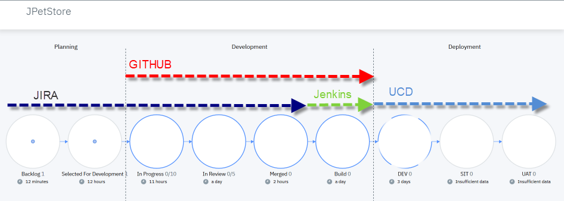

# JPetStore Application CI/CD Process

Changes for Story 8 ??

Our continuous integration / continuous deployment process contains 3 main phases - from Planning to Development to Deployment - and a certain number of stages per phase : Backlog, Selected for Development, In Progress, In Review…



We use :
- JIRA to track the progress of our project.
- Jenkins to drive the build.
- And finally UrbanCode Deploy to deploy into the different environments.

When we create a new Story in the Backlog of JIRA. It is displayed  in the “Backlog” stage in Velocity.

-	Move the stories and bugs that will be included in the next release to “Selected for Development stage”. The story is then displayed in the “Selected for Development phase” on Velocity

-	As soon as a developer starts to work on a Story or a Bug, he moves the story into the “In Progress stage” and start coding. The story is then displayed in the “In Progress” stage in Velocity.

-	The developer starts to work on the story.

In GIT:
- The developer has a workspace with a copy of the master branch in a local directory where a copy of the origin is stored:
```
  git init
  git remote add origin git@github.com:VialeMuriel/JPetStore.git
  git push -u origin master
  git fetch origin
```
- The developer is working on a // branch called “JPET-N-develop” where JPET-N references the JIRA story ID or bug
```
git checkout -b JPET-N-develop
change a file for example app/JPetStore.war (changes for issue N)
git add .
git commit -m “JPET-N (changes for story N)”
git push origin JPET-N-develop
```
- Back to GIT hub, we can see the commit in the develop branch
-	The developer opens a pull request to push his code in the review process. The story goes into the “In Review” stage on Velocity. We can open the pull request in GitHub by clicking in the history of the dots.

-	After the review process, the pull request is merged and the changes are merged into the master branch. The story move to the “Merged” state in Velocity. Again, we can go from the dot to the GitHub with the link provided in the detail view of the dot.

-	The code is now ready to be built and pushed to the artefact repository (code station in our case). As the build starts in Jenkins, the story goes into the Build stage in Velocity and the new version is loaded into UrbanCode Deploy.


The version can be deployed in DEV and tested.
When the development of all the stories comes to a stable state, a snapshot of the DEV environment is created with the latest components versions.

This snapshot appears immediately as an input on the Velocity pipeline and can be used to release a more complete version on the DEV environment.

We can now push the snapshot to the DEV environment using Velocity. All components and applications participating to the release will be pushed and tested together.

After test and validation of our snapshot on DEV, the release can then be pushed to the SIT environment, and update the JPetStore website.  
